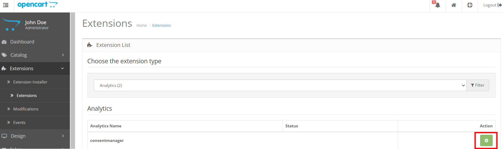
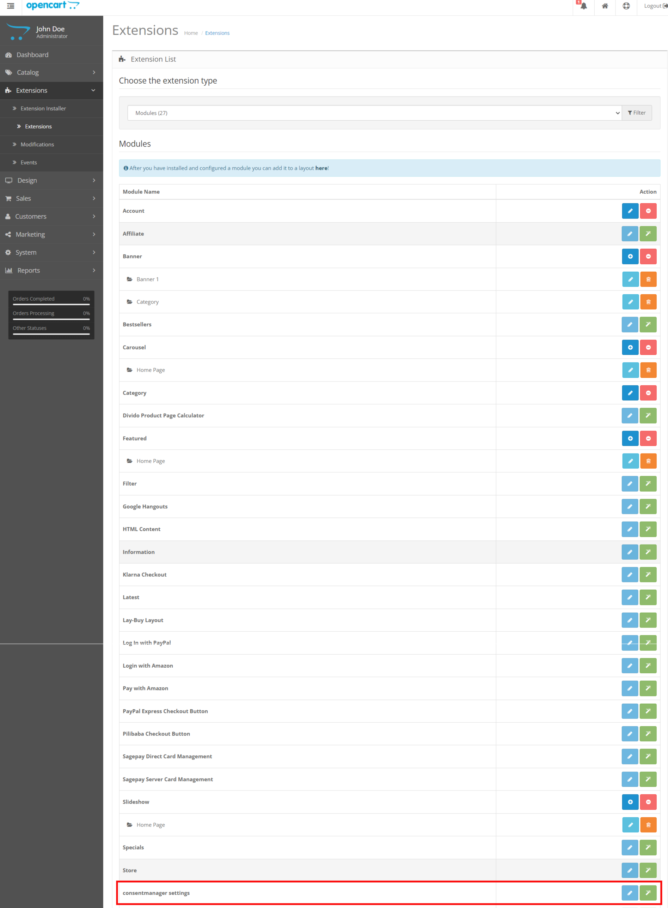
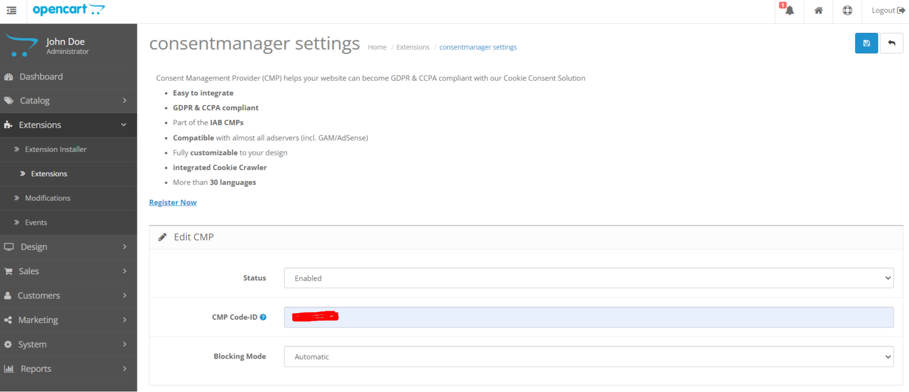

# ConsentManager.net

## Installation

1. Download the main repository package from (https://github.com/iubenda/cm-plugin-opencart23)
2. Unzip the package.
3. And upload the files of 'upload' folder to under path/to/project/ folder via FTP.
4. This package not overwriting any core files.

== Install ==

Here you have to install 2 extensions because of OpenCart 2.3.2 bug(It is not allowing edit option for other extenstions in the analytics extention type, because they placed closing } curly brace in wrong iterative loop)

1. Navigate Extensions => Extensions
2. Choose the Extension type as 'Analytics' (By default it is selected if you're navigating to the extensions page first time)
3. Locate the 'consentmanager' extension and click green colored + icon to install the extension.

4. Choose the Extension type as 'Module'
5. Scroll down to locate the 'consentmanager settings' extension and click green colored + icon to install the extension.

## Upgradation

1. Download the main repository package from (https://github.com/iubenda/cm-plugin-opencart23)
2. Unzip the package.
3. And upload the files of 'upload' folder to under path/to/project/ folder via FTP.
4. This would overwrite/replace the old extension files.

## Configuration

1. Navigate Extensions => Extensions
2. Choose the Extension type as 'Module'
3. Scroll down to locate the 'consentmanager settings' extension
4. Click blue colored pencil icon to edit the extension.
5. Enter CMP ID, you get this from consentmanager.net
6. Select the Mode: Automatic or Semi-Automatic

## Using

1. Go to shop frontend to view consentmanager.net in place.

## Changelog

= 1.0.0 =
* Initial release.
* Tested on 2.3.0.2
* 01 Jul, 2024
